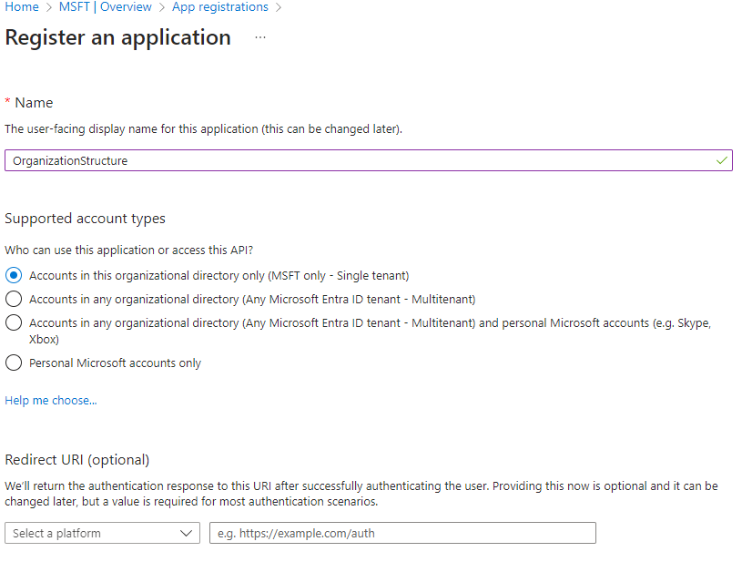
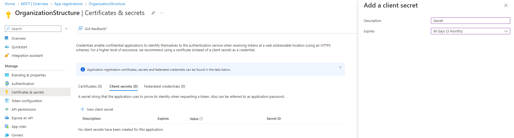
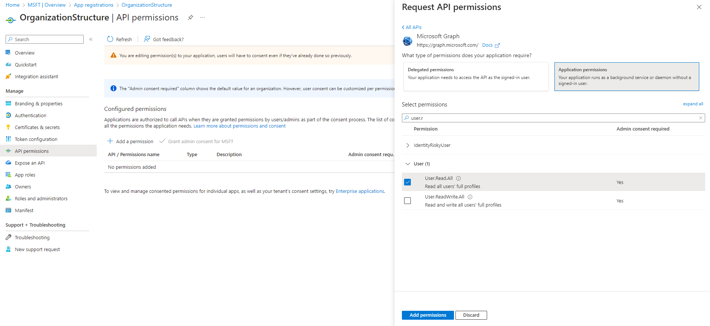
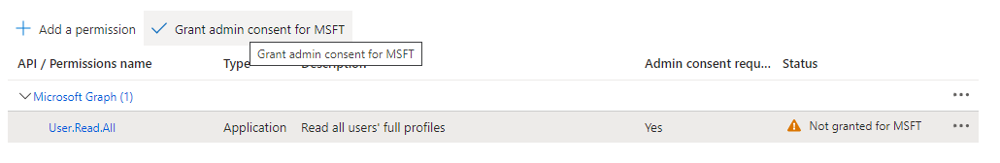
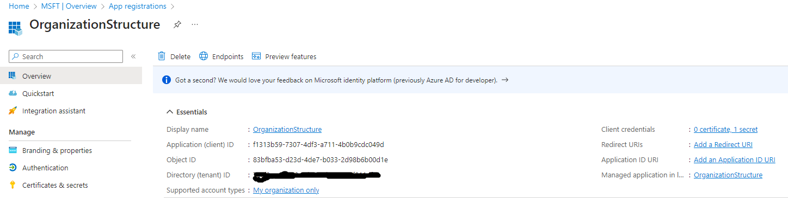

# msgraph-organization-markmap
Generates Markdown file with organizational structure for the markmap tool.

## Getting started
### Register the app in Azure AD
The app needs the `User.Read.All` application permission
#### Create a new app

#### Add client secret

#### Add permission

#### Grant permission

#### Use tenant id, client id and client secret


### Build the solution
Build the solution

### Run from Visual Studio
In Visual Studio click on **Debug** -> **Organization.Structure Debug Properties** and add values for **tenantId**, **clientId**, **clientSecret** and **outputFolder** parameters.

### Run console app
`OrganizationStructure.Generator.exe <tenantId> <clientId> <clientSecret> <outputFolder>`

If you have an access token that contains `User.Read.All` delegated/application permission

`OrganizationStructure.Generator.exe <accessToken> <outputFolder>`

### View markmap
Open the [demo page](https://markmap.js.org/repl) and copy the content of generated Markdown file.


Or run markmap command line tool
```
$ npx markmap-cli path_to_generated_markdown_file
```